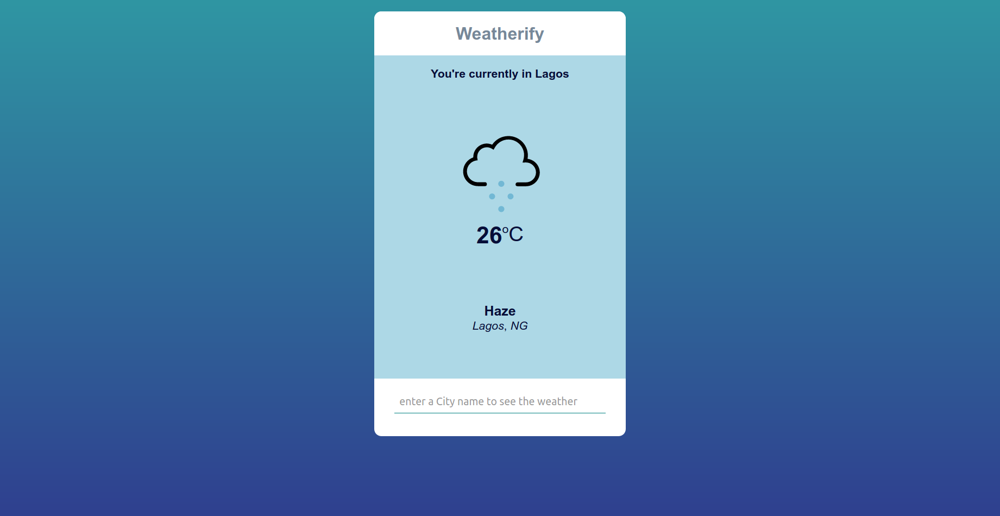

# Weather App

> In this project, I build a weather app using promises and the Fetch API. In this project, I also considered using async and await functions but chose to use promises instead. For API calls, I used the API provided by openweatherapp.com. 



## Built With

- HTML, CSS, Javascript
- Materialize CSS
- Fetch API
- npm
- Webpack

## Linters used
- ESlint


## Live Demo

[Live Demo Link](https://sleepy-wing-03ddf5.netlify.com/)

## Clone the project
```
git clone https://github.com/onedebos/weather-app.git
```

## Install dependencies

```
npm install
```


## Authors

👤 **Adebola**

- Github: [@githubhandle](https://github.com/onedebos)
- Twitter: [@twitterhandle](https://twitter.com/debosthefirst)
- Linkedin: [linkedin](https://www.linkedin.com/in/adebola-niran/)

## Show your support

Give a ⭐️ if you like this project!


## 📝 License

This project is [MIT](lic.url) licensed.
# weather-app
